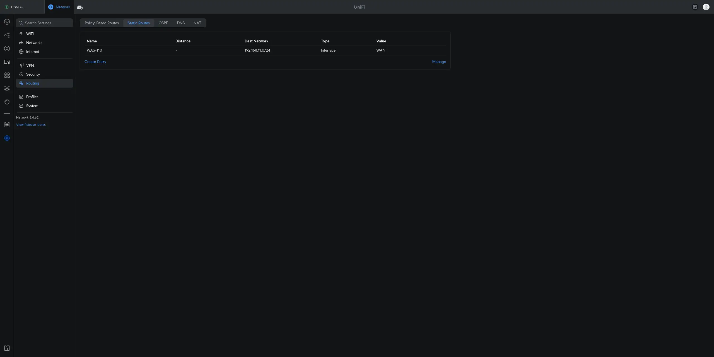
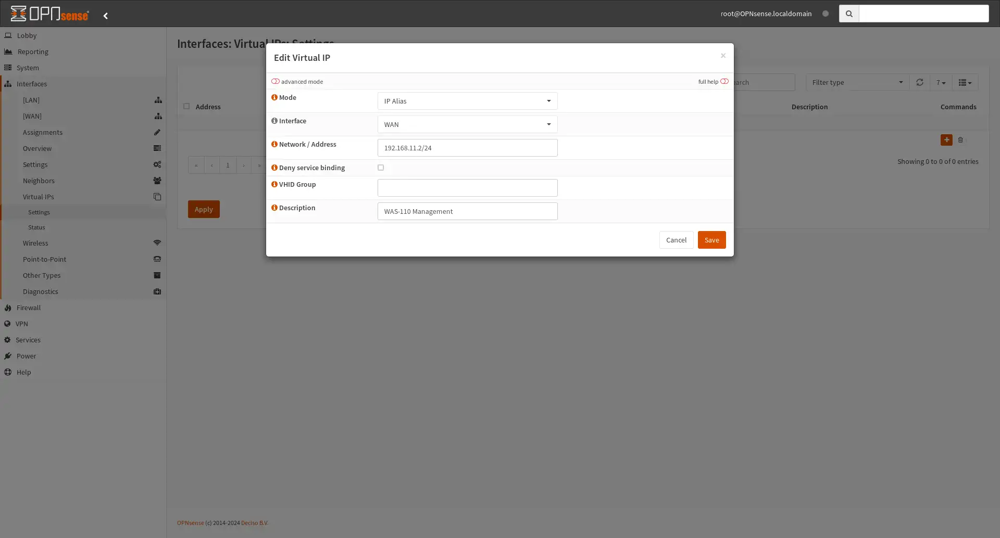
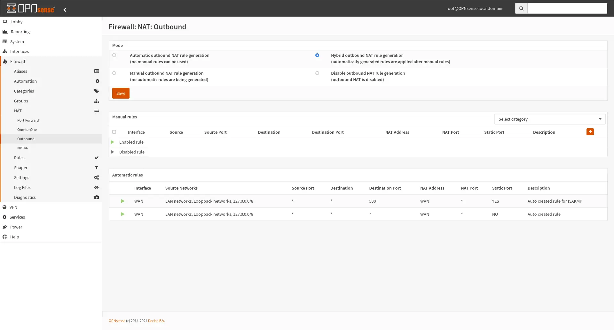
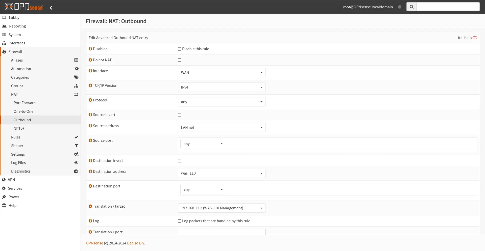
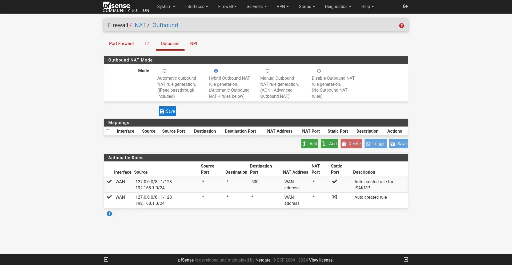
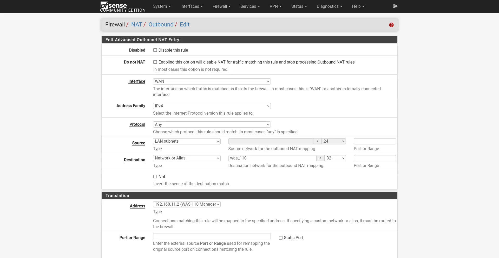

# Install 8311 community firmware on the BFW Solutions WAS-110

{ class="nolightbox" }
<!-- more -->
<!-- nocont -->

??? tip "Group buy participants..."
    Just a reminder that your [WAS-110] should have come pre-flashed with the 8311 community firmware unless otherwise
    indicated.

    Please ignore the Azores [shell upgrade] and [web UI upgrade](#web-ui-upgrade) sections mentioned below. To update
    your [WAS-110] to a *newer* 8311 community firmware release, refer to the instructions in the
    [supplementary upgrade] section.

Out of the box, the [WAS-110] is not fully compatible with varying ISP OLT configurations, with issues ranging from
vendor-specific managed entities to VEIP to IEEE standards such as [802.1X] and [802.1ad]. Due to these
incompatibilities and discovered bugs, a community firmware[^1] has been curated to fix any impeding issues[^2].

  [802.1X]: https://en.wikipedia.org/wiki/IEEE_802.1X
  [802.1ad]: https://en.wikipedia.org/wiki/IEEE_802.1ad

## Firmware Preparation

### Download firmware

The community firmware comes in two (2) variants: *basic* and *bfw*; for the purposes of this guide, we'll focus on
the recommended <ins>basic</ins> firmware, which can be downloaded at:

<https://github.com/djGrrr/8311-was-110-firmware-builder/releases/latest>

As an example, the following command downloads the *basic* firmware into the current users download directory.

=== ":material-microsoft: Windows"

    ``` sh
    curl -L --output-dir %UserProfile%\Downloads -O https://github.com/djGrrr/8311-was-110-firmware-builder/releases/download/v2.7.1/WAS-110_8311_firmware_mod_v2.7.1_basic.exe
    ```

=== ":simple-apple: macOS / :simple-linux: Linux"

    ``` sh
    curl -L --output-dir ~/Downloads -O https://github.com/djGrrr/8311-was-110-firmware-builder/releases/download/v2.7.1/WAS-110_8311_firmware_mod_v2.7.1_basic.7z
    ```

The *basic* firmware is based on a vanilla MaxLinear [OpenWrt] 19.07 build from [Potrontec]. Additionally, it
includes customized luci web interfaces for hassle-free masquerading and the aforementioned fixes. And unlike the *bfw*
variant, it does not include the abysmal BFW patches and cruft.

  [OpenWrt]: https://openwrt.org/
  [Potrontec]: https://www.potrontec.com/

### Extract download

The community firmware upgrade comes bundled as a self-extracting executable (:material-microsoft: Windows only) or a
[7-Zip] archive and includes:

`local-upgrade.img`

:   Used with the Azores [web upgrade] utility.

`local-upgrade.tar`

:   Used with the universal [shell upgrade] command sequence.

  [web upgrade]: #web-ui-upgrade
  [shell upgrade]: #shell-upgrade
  [7-Zip]: https://www.7-zip.org/

To extract the archive to a temporary directory, execute the following command(s):

!!! info "Replace `<version>` with the downloaded version."

=== ":material-microsoft: Windows"

    #### Self-extracting Executable

    Double-click on the exe file in [Windows File Explorer].

    #### 7-zip

    ``` sh
    7z e "-i!local-upgrade.*" %UserProfile%\Downloads\WAS-110_8311_firmware_mod_<version>_basic.7z -o%Temp%\8311
    ```

      [Windows File Explorer]: https://en.wikipedia.org/wiki/File_Explorer

=== ":simple-apple: macOS"

    !!! bug "macOS Archive Utility mangles the extracted `local-upgrade.tar`"

    !!! note "The following commands assume [Homebrew](https://brew.sh) is installed"

    ``` sh
    brew install sevenzip
    7zz e '-i!local-upgrade.*' ~/Downloads/WAS-110_8311_firmware_mod_<version>_basic.7z -o/tmp
    ```

=== ":simple-linux: Linux"

    !!! note "The following commands assume [Debian] or derivatives[^3]"

    ``` sh
    sudo apt-get install p7zip-full
    7z e '-i!local-upgrade.*' ~/Downloads/WAS-110_8311_firmware_mod_<version>_basic.7z -o/tmp #(1)!
    ```

## Network setup

Plug the [WAS-110] into a 10-gigabit compatible SFP+ host interface, such as a NIC, media converter, and/or network
switch.

!!! note "Rx loss"
    The [WAS-110] running the default Azores firmware will trigger RX_LOS if the SC/APC fiber cable is unplugged or
    inactive. Some host interfaces will enter a power-saving state, making the [WAS-110] inaccessible.

The default IP address of the [WAS-110] is `192.168.11.1/24`. To connect successfully, choose one (1) of the following
configurations based on your network setup:

* [Static IP](#static-ip)
* [Static Route](#static-route)
* [Source NAT](#source-nat)

=== "Static IP"
    
    === ":material-microsoft: Windows"

        !!! tip "Run Command Prompt as Administrator"

            1. Press ++win+r++
            2. In the Run dialog box, type `cmd` into the input field and then press
               ++ctrl+shift+enter++.

        ``` sh hl_lines="2"
        netsh interface ip show config # (1)!
        netsh interface ipv4 set address name="<interface name>" static 192.168.11.2 255.255.255.0 192.168.11.1
        netsh interface ipv4 set interface "<interface name>" mtu=1500
        ```

        1. Replace `<interface name>` in the next commands with a interface name from the output.

        Execute the following command to restore DHCP, *only* if the static IP was temporary for setup.

        ``` sh
        netsh interface ipv4 set address name="<interface name>" dhcp
        ```

        ??? info "For the shameless mouse clickers..."
            If you are more comfortable with the Windows GUI, follow the <ins>manual</ins> steps outlined by Microsoft at:

            <https://support.microsoft.com/en-us/windows/change-tcp-ip-settings-bd0a07af-15f5-cd6a-363f-ca2b6f391ace>

    === ":simple-apple: macOS"

        !!! tip "Replace `<service>` with the SFP+ interface name."

        ``` sh hl_lines="2"
        sudo networksetup -listallnetworkservices # (1)!
        sudo networksetup -setmanual <service> 192.168.11.2 255.255.255.0 192.168.11.1
        ```

        1. Replace `<service>` in the next command with a network service from the output.

        Execute the following command to restore DHCP, *only* if the static IP was temporary for setup.

        ``` sh
        sudo networksetup -setdhcp <service>
        ```

        ??? info "For the shameless mouse clickers..."
            If you are more comfortable with the macOS GUI, follow the <ins>manual</ins> steps outlined by Apple at:

            * <https://support.apple.com/en-ca/guide/mac-help/mchlp2718/mac>
            * <https://support.apple.com/en-ca/guide/mac-help/mh14129/mac>

    === ":simple-linux: Linux"

        !!! note "The following commands set the IP address <ins>temporarily</ins> until the next power cycle"
            For persistence check your OS documentation, such as
            [Debian Network Configuration](https://wiki.debian.org/NetworkConfiguration)

        !!! note "The following commands must be run as root `su -` or prepended with `sudo`"

        ``` sh hl_lines="6"
        ip link show
        ethtool <interface>
        ip address show
        ip address flush dev <interface>
        ip route flush dev <interface>
        ip address add 192.168.11.2/24 dev <interface>
        ip address show dev <interface>
        ```

=== "Static Route"

    === ":simple-ubiquiti: UniFi Dream Machine"

        

        1. Set the SFP port as the WAN interface. This is under **Network > Settings > Internet**.

        

        2. Create a static route pointing at the WAN interface. This is under **Network > Settings > Routing > Static Routes**

=== "Source NAT"

    === ":simple-opnsense: OPNsense"

        

        1. Add a virtual IP to the WAN interface by navigating to **Interfaces > Virtual IPs > Settings**, clicking
           :material-plus-thick:, applying the settings below, clicking **Save**, and clicking **Apply**.

            |                                  |                                   |
            | -------------------------------- | --------------------------------- |
            | **Mode**                         | IP Alias                          |
            | **Interface**                    | WAN                               |
            | **Network / Address**            | 192.168.11.2/24                   |
            | **Deny service binding**         | :material-checkbox-blank-outline: |
            | **VHID Group**                   |                                   |
            | **Description**                  | WAS-110 Management                |

        

        2. Add a firewall alias by navigating to **Firewall > Aliases**, clicking :material-plus-thick:, applying the
           settings below, clicking **Save**, and clicking **Apply**.

            |                                  |                                    |
            | -------------------------------- | ---------------------------------- |
            | **Enabled**                      | :material-checkbox-marked-outline: |
            | **Name**                         | was_110                            |
            | **Type**                         | Host(s)                            |
            | **Categories**                   |                                    |
            | **Content**                      | 192.168.11.1                       |
            | **Statistics**                   | :material-checkbox-blank-outline:  |
            | **Description**                  | WAS-110                            |

        

        3. Switch to Hybrid outbound NAT by navigating to **Firewall > Outbound > NAT**, selecting
           **Hybrid outbound NAT rule generation**, clicking **Save**, and clicking **Apply changes**.

        

        4. Add a manual outbound NAT rule, click :material-plus-thick: in the **Manual rules** table, apply the
           settings below, click **Save**, and click **Apply changes**.

            |                                   |                                              |
            | --------------------------------- | -------------------------------------------- |
            | **Interface**                     | WAN                                          |
            | **Source address**                | LAN net                                      |
            | **Destination address**           | was_110                                      |
            | **Translation / target**          | 192.168.11.2 (WAS-110 Management)            |

    === ":simple-pfsense: pfSense"

        

        1. Add a virtual IP to the WAN interface by navigating to **Firewall > Virtual IPs**, clicking
           :material-plus-thick: **Add**, applying the settings below, clicking **Save**, and clicking **Apply Changes**.

            |                                  |                                   |
            | -------------------------------- | --------------------------------- |
            | **Type**                         | IP Alias                          |
            | **Interface**                    | WAN                               |
            | **Address(es)**                  | 192.168.11.2/24                   |
            | **Description**                  | WAS-110 Management                |

        

        2. Add a firewall alias by navigating to **Firewall > Aliases > IP**, clicking :material-plus-thick: **Add**,
           applying the settings below, clicking **Save**, and clicking **Apply Changes**.

            | Properties                       | &nbsp;                             |
            | -------------------------------- | ---------------------------------- |
            | **Name**                         | was_110                            |
            | **Description**                  | WAS-110                            |
            | **Type**                         | Host(s)                            |
            
            | Host(s)                          | &nbsp;                             |
            | -------------------------------- | ---------------------------------- |
            | **IP or FQDN**                   | 192.168.11.1                       |

        

        3. Switch to Hybrid outbound NAT by navigating to **Firewall > NAT > Outbound**, selecting
           **Hybrid Outbound NAT rule generation**, clicking **Save**, and clicking **Apply Changes**.

        

        4. Add a manual outbound NAT rule, click :material-arrow-up: **Add** in the **Mappings** table, apply the
           settings below, click **Save**, and click **Apply Changes**.

            | Edit Advanced Outbound NAT Entry  | &nbsp;                                       |
            | --------------------------------- | -------------------------------------------- |
            | **Interface**                     | WAN                                          |
            | **Source**                        | LAN subnets                                  |
            | **Destination**                   | Network or Alias - was_110 / 32              |


            | Translation                       | &nbsp;                                       |
            | --------------------------------- | -------------------------------------------- |
            | **Address**                       | 192.168.11.2 (WAS-110 Management)            |

    === ":simple-ubiquiti: UniFi Dream Machine"

        1. Enable SSH by navigating to **OS Settings > Console Settings > Advanced**.
    
            <https://help.ui.com/hc/en-us/articles/204909374-UniFi-Connect-with-Debug-Tools-SSH>

        2. Set the **Primary (WAN1)** interface to `Port 10 (SFP+)` by navigating to **Network > Settings > Internet**.

        3. Connect and execute the following command from a SSH session:

            !!! tip "Interface numbers are zero (0) indexed, e.g. `eth9` for Port 10"

            !!! warning "The command is <ins>temporarily</ins>, until the next power cycle or web UI change"

                ``` sh
                ip addr add dev eth9 local 192.168.11.2/24
                ```

                For boot persistence, please consider installing [on-boot-script-2.x](https://github.com/unifi-utilities/unifios-utilities/tree/main/on-boot-script-2.x).

        4. Create a Source NAT rule by navigating to **Network > Settings > Routing > NAT**, followed by clicking **Create Entry**.

            |                           |                                                                            |
            | ------------------------- | -------------------------------------------------------------------------- |
            | **Type**                  | Source                                                                     |
            | **Name**                  | WAS-110                                                                    |
            | **Protocol**              | All                                                                        |
            | **Interface**             | Primary (WAN1)                                                             |
            | **Translated IP Address** | IPv4 Address / Subnet<br/>192.168.11.2                                     |
            | **Translated Port**       | :material-checkbox-blank-outline:                                          |
            | **Source**                | :material-checkbox-blank-outline:                                          |
            | **Destination**           | :material-checkbox-marked-outline: IPv4Address / Subnet <br/> 192.168.11.1 |
            | **Destination Port**      | :material-checkbox-blank-outline:                                          |
            | **Advanced**              | Manual                                                                     |
            | **Remote Logging**        | :material-checkbox-blank-outline:                                          |
            | **Exclude**               | :material-checkbox-blank-outline:                                          |
 
            !!! note "Prior to Network 8.3.32, the Source NAT rule could ^^ONLY^^ be applied using the shell"

                ``` sh
                iptables -t nat -A POSTROUTING -o eth9 -d 192.168.11.1 -j SNAT --to 192.168.11.2
                ```

You should now be able to access the [WAS-110] at `192.168.11.1`.

## Dump & backup firmware <small>optional</small> { #dump-and-backup-firmware data-toc-label="Dump & backup firmware" }

1. [Enable SSH] from the web UI by following the steps outlined below in the shell upgrade section.

2. Login to the [WAS-110] remote shell over SSH using the *root* [shell credentials]{ target="_blank" }.

    ``` sh
    ssh -oHostKeyAlgorithms=+ssh-rsa -oPubkeyAcceptedKeyTypes=+ssh-rsa root@192.168.11.1
    ```

3. Execute the following command sequence from the [WAS-110] remote shell to dump its volumes into the temp directory.

    ``` sh
    mkdir -p /tmp/fw; for part in kernelA bootcoreA rootfsA kernelB bootcoreB rootfsB; do VOL=$(ubinfo /dev/ubi0 -N "$part" | grep "Volume ID" | awk '{print $3}'); [ -n "$VOL" ] && { DEV="/dev/ubi0_$VOL"; OUT="/tmp/fw/ubi0_$VOL-$part.img"; echo "Dumping $part ($DEV) to: $OUT"; dd if="$DEV" of="$OUT"; }; done; exit
    ```

4. Execute the following command from the host PC terminal to back-up the dumped volumes to your local user directory.

    === ":material-microsoft: Windows"

        ??? note "Windows 10 and prior versions..."
            The `scp` command may require the `-O` option parameter to use the legacy SCP protocol.

            If you continue to have issues, consider installing and running [WinSCP](https://winscp.net/)
            instead *(Remember to choose the SCP file protocol)*.

            Also, an alternative to the `ssh` command is [Putty](https://putty.org/).

        **Command Prompt**

        ``` sh
        cd /D %UserProfile% & scp -oHostKeyAlgorithms=+ssh-rsa -oPubkeyAcceptedKeyTypes=+ssh-rsa root@192.168.11.1:/tmp/fw/ubi* .
        ```

        **Powershell / Windows Terminal**

        ``` sh
        cd /D %UserProfile%; scp -oHostKeyAlgorithms=+ssh-rsa -oPubkeyAcceptedKeyTypes=+ssh-rsa root@192.168.11.1:/tmp/fw/ubi* .
        ```

    === ":simple-apple: macOS / :simple-linux: Linux"

        ``` sh
        cd ~/; scp -O -oHostKeyAlgorithms=+ssh-rsa -oPubkeyAcceptedKeyTypes=+ssh-rsa 'root@192.168.11.1:/tmp/fw/ubi*' ./
        ```

## Shell upgrade <small>recommended</small> { #shell-upgrade data-toc-label="Shell upgrade" }

The extracted `local-upgrade.tar` includes a <ins>safer</ins> upgrade script in comparison to the built-in web UI.

### Enable SSH

SSH must be enabled from the web UI prior to running the shell commands.


1. Within a web browser, navigate to
   <https://192.168.11.1/html/main.html#service/servicecontrol>
   and, if asked, input the *admin* [web credentials]{ target="_blank" }.


2. From the __Service Control__ page, check the __SSH__ checkbox and click __Save__.

### Upgrade firmware

Run the following commands from the host terminal to upgrade to the 8311 community firmware.

Input the *root* [shell credentials]{ target="_blank" } when asked.

=== ":material-microsoft: Windows"

    ??? note "Windows 10 and prior versions..."
        The `scp` command may require the `-O` option parameter to use the legacy SCP protocol.

        If you continue to have issues, consider installing and running [WinSCP](https://winscp.net/)
        instead *(Remember to choose the SCP file protocol)*.

        Also, an alternative to the `ssh` command is [Putty](https://putty.org/).

    ``` sh
    scp -oHostKeyAlgorithms=+ssh-rsa -oPubkeyAcceptedKeyTypes=+ssh-rsa %Temp%\8311\local-upgrade.tar root@192.168.11.1:/tmp/
    ssh -oHostKeyAlgorithms=+ssh-rsa -oPubkeyAcceptedKeyTypes=+ssh-rsa root@192.168.11.1 "tar xvf /tmp/local-upgrade.tar -C /tmp/ -- upgrade.sh && /tmp/upgrade.sh -y -r /tmp/local-upgrade.tar"
    ```

=== ":simple-apple: macOS / :simple-linux: Linux"

    ``` sh
    scp -O -oHostKeyAlgorithms=+ssh-rsa -oPubkeyAcceptedKeyTypes=+ssh-rsa /tmp/local-upgrade.tar root@192.168.11.1:/tmp/
    ssh -oHostKeyAlgorithms=+ssh-rsa -oPubkeyAcceptedKeyTypes=+ssh-rsa root@192.168.11.1 'tar xvf /tmp/local-upgrade.tar -C /tmp/ -- upgrade.sh && /tmp/upgrade.sh -y -r /tmp/local-upgrade.tar'
    ```

Once rebooted, enjoy the labor of love of the 8311 community. As a first step, it is recommended to perform a
[supplementary upgrade].

!!! note "New SSH host keys will be generated"
    Don't be alarmed when attempting to connect over SSH into the newly installed firmware and the following warning is
    presented:

    ```
    @@@@@@@@@@@@@@@@@@@@@@@@@@@@@@@@@@@@@@@@@@@@@@@@@@@@@@@@@@@
    @    WARNING: REMOTE HOST IDENTIFICATION HAS CHANGED!     @
    @@@@@@@@@@@@@@@@@@@@@@@@@@@@@@@@@@@@@@@@@@@@@@@@@@@@@@@@@@@
    IT IS POSSIBLE THAT SOMEONE IS DOING SOMETHING NASTY!
    Someone could be eavesdropping on you right now (man-in-the-middle attack)!
    It is also possible that a host key has just been changed.
    The fingerprint for the ECDSA key sent by the remote host is
    SHA256:Y3WzWezEYQi5374JfEa4KMm2nqfkj7raMyZIi6TS+X4.
    Please contact your system administrator.
    Add correct host key in /home/8311/.ssh/known_hosts to get rid of this message.
    Offending ECDSA key in /home/8311/.ssh/known_hosts:1
    Host key for 192.168.11.1 has changed and you have requested strict checking.
    Host key verification failed.
    ```

    Simply delete the old host ID by running the following command and retry:

    ```
    ssh-keygen -R 192.168.11.1
    ```

## Web UI upgrade <small>not recommended</small> { #web-ui-upgrade data-toc-label="Web UI upgrade" }

!!! danger "Proceed with caution!"
    The Azores firmware upgrade utility on occasion is known to soft-brick itself. To recover, a host device with
    serial breakout on SFP pins 2 (rx) and 7 (tx) will be required.

    Alternatively, jump to the <ins>safer</ins> [shell upgrade](#shell-upgrade) within this guide.


1. Within a web browser, navigate to
   <https://192.168.11.1/html/main.html#admin/upgrade>
   and, if asked, input the *admin* [web credentials]{ target="_blank" }.


!!! danger "50/50 chance of soft-bricking the [WAS-110] if proceeded!"

2. From the __Firmware Upgrade__ page, browse for `local-upgrade.img` from the extracted download, and click
   __Upgrade__.

Patiently wait out the process, 4 to 5 minutes, or until the web session becomes unresponsive.

??? tip "Run a continuous ping"
    To recieve an early indication that the [WAS-110] has completed its upgrade reboot cycle, run a continuous ping:

    === ":material-microsoft: Windows"

        ``` sh
        ping -t 192.168.11.1
        ```

    === ":simple-apple: macOS / :simple-linux: Linux"

        ``` sh
        ping 192.168.11.1
        ```

Once rebooted, enjoy the labor of love of the 8311 community. As a first step, it is recommended to perform a
[supplementary upgrade].

## Supplementary upgrades

### A/B architecture

``` mermaid
block-beta
    block:BOOT
        columns 1
        mtd0("<b>uboot</b>\n/dev/mtd0")
        mtd1("<b>ubootconfigA</b>\n/dev/mtd1")
        mtd2("<b>ubootconfigB</b>\n/dev/mtd2")
    end
    block:UBI("/dev/ubi0")
        columns 2
        block A
            columns 1
            mtd9("<b>kernelA</b>\n/dev/mtd9")
            mtd10("<b>bootcoreA</b>\n/dev/mtd10")
            mtd11("<b>rootfsA</b>\n/dev/mtd11")
        end
        block B
            columns 1
            mtd12("<b>kernelB</b>\n/dev/mtd12")
            mtd13("<b>bootcoreB</b>\n/dev/mtd13")
            mtd14("<b>rootfsB</b>\n/dev/mtd14")
        end
        block:PERSIST:2
            columns 1
            mtd15("<b>ptconf</b>\n/dev/mtd15")
            mtd16("<b>rootsfs_data</b>\n/dev/mtd16")
        end
    end
    classDef transparentBlock fill:transparent,stroke:transparent;
    classDef boldTitle fill:transparent,stroke:transparent,font-weight:bold;
    class BOOT,PERSIST transparentBlock
    class A,B boldTitle
```

The [WAS-110] uses an A/B architecture, which means there are two adjacent firmware images: an active image
(the currently running and firmware) and an inactive image. Either image can be selected as active, and upon upgrade,
the inactive image will be overwritten and become the newly active image after reboot, i.e. committed image.

Furthermore, the OLT has the capability to select the active firmware image, upgrade the inactive image, and reboot
the ONT. It is therefore recommended to install the community firmware on both A and B slots.

### Web UI upgrade <small>safe</small> { #8311-web-ui-upgrade data-toc-label="Web UI upgrade" }

!!! info "Integrity first and foremost"
    The 8311 community firmware re-uses the <ins>safe</ins> shell upgrade logic throughout. Those who prefer the CLI
    may continue to use the [shell upgrade] method going forward.

    Furthermore, the 8311 community firmware includes an up-to-date `dropbear`[^5] build, which does not require the use
    of weak algorithms when using an SSH client, i.e.

    `-oHostKeyAlgorithms=+ssh-rsa -oPubkeyAcceptedKeyTypes=+ssh-rsa`

    can be removed from future command usage.


1. Within a web browser, navigate to
   <https://192.168.11.1/cgi-bin/luci/admin/8311/firmware>
   and, if asked, input your *root* password.

2. From the __Firmware__ page, browse for `local-upgrade.tar` from the extracted download, and click __Upload__.

  [Debian]: https://www.debian.org/
  [WAS-110]: ../xgs-pon/ont/bfw-solutions/was-110.md
  [web credentials]: ../xgs-pon/ont/bfw-solutions/was-110.md#web-credentials
  [shell credentials]: ../xgs-pon/ont/bfw-solutions/was-110.md#shell-credentials
  [supplementary upgrade]: #supplementary-upgrades
  [shell upgrade]: #upgrade-firmware
  [Enable SSH]: #enable-ssh

[^1]: <https://github.com/djGrrr/8311-was-110-firmware-builder>
[^2]: <https://github.com/djGrrr/8311-xgspon-bypass>

      <https://github.com/djGrrr/8311-was-110-firmware-builder/blob/master/mods/>
[^3]: <https://www.debian.org/derivatives/>
[^4]: <https://en.wikipedia.org/wiki/Internet_Protocol_version_4#First_and_last_subnet_addresses>
[^5]: <https://en.wikipedia.org/wiki/Dropbear_(software)>
